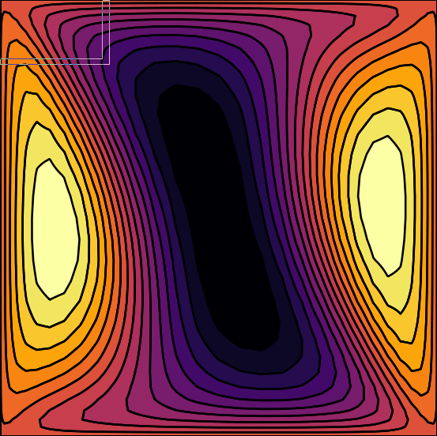

# FourSidedCavityFlow.jl

Development of a Navier-Stokes benchmark solver for the four-sided cavity flow
using spectral methods. The package is designed to provide a reproducable
example to compare discretizations and boundary conditions. 

[](https://morwald.github.io/FourSidedCavityFlow.jl)
[](https://github.com/morwald/FourSidedCavityFlow.jl/actions/workflows/CI.yml?query=branch%3Amain)
[](https://codecov.io/gh/morwald/FourSidedCavityFlow.jl)




This project aims at developing a set of numerical
algorithms for the study of the dynamics, linear stability, and
bifurcations arising in the four-sided cavity flow. This problem has
recently been vindicated as an ideal benchmark problem for testing the
accuracy and reliability of Navier-Stokes solvers. The flows arising
in this problem exhibit all kinds of fundamental bifurcations (local
and global), such as pitchfork, fold, Hopf, and homoclinic, some of
them subcritical. These bifurcations seem to take place for low or
moderate Reynolds numbers, thus alleviating the spatial resolution
required to obtain accurate results.

## Installation

### To run the results

The `studies` folder provides scripts to generate results and images for the
problem. The README inside the folder contains the necessary information to run
the simulations.

### For development

The Julia module is not yet a registered package. To work on the development
version clone this git repository. Navigate to the root directory and start the
Julia REPL. 
```bash
git clone https://github.com/morwald/FourSidedCavityFlow.jl.git
cd FourSidedCavityFlow.jl
julia
```

Inside the REPL open the built-in package manager Pkg by pressing `]` and then
run.
```julia
pkg>activate .
pkg>instantiate
```
This will activate the package and download the necessary dependencies. To run
the tests and check if everything is working: 
```julia
pkg>test
```

## Documentation

The development documentation can be found
[here](https://morwald.github.io/FourSidedCavityFlow.jl).
