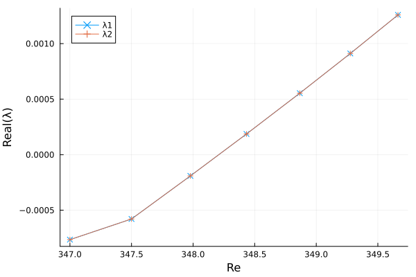

# Examples 

To set up the four-sided cavity flow problem in Julia, instantiate the `struct
p`, of type CavityStruct, with a Chebyshev polynomial of order $n$ and a
Reynolds number $\mathrm{Re}$. This generates a grid of size
$(n+1)\times(n+1)$, and all the parameters and cache variables needed to run
the simulations. To illustrate, $n = 32$ is used, which is too small for
accurate computations but enough to show how the module works.
```julia
using FourSidedCavityFlow 
const CF = FourSidedCavityFlow

n = 32;
Re = 1;
p = CF.setup_struct(n, Re);
```

## Steady-State Solutions

We can run the `steadystate` function for a given Reynolds number $\mathrm{Re}$
to converge to a steady-state solution with Newton's method. For example the
symmetric base solution for a Reynolds of $\mathrm{Re} = 50$ can be computed by
setting the streamfunction matrix to zeros as an initial guess.
```julia
p.params.Re = 50;
Ψ0 = zeros((n + 1), (n + 1));

Ψ, iter, tol = CF.steadystate(Ψ0, p);
```

The results can be visualized in the physical domain by transposing the $\Psi$
matrix and mirror the solution at the $y$ axis. 
```julia
using Plots

contourf(reverse(p.params.nodes), reverse(p.params.nodes), Ψ', xlim = (-1, 1), 
    ylim = (-1, 1), aspect_ratio = 1, axis = ([], false), color = :davos)
```


## Time-Stepping

The asymmetric solutions can be computed by doing time integration.
```julia
p.params.Re = 100;
timesteps = 140;
h = 1;
Ψi = -1e-3 * abs.(randn((n + 1), (n + 1)));

sol, timeseries = CF.timestepping(Ψi, p, h, timesteps, savesteps = true, verbose = true);

contourf(reverse(p.params.nodes), reverse(p.params.nodes), sol[end, :, :]'; xlim = (-1, 1), 
   ylim = (-1, 1), aspect_ratio = 1, axis = ([], false), color = :davos)

plot(timeseries, sol[:, p.params.ic, p.params.ic]; xlabel = "time", ylabel = "Ψcenter", label = false)
```


## Pseudo-Arclength Continuation

We can continue the asymmetric solution branch as a function of the Reynolds
number. The obtained solution of the time-stepping above will be converged with
the steady-state function. Then the continuation algorithm is started from this
Reynolds number. Here a $\Delta \mathrm{Re} = 1$ is chosen.
```julia
Re_start = 100;
p.params.Re = Re_start;
Ψs, iter, tol = CF.steadystate(sol[end, :, :], p);

ΔRe = 1;
Re_steps = 200; # as a test
#Re_steps = 840; # steps needed to capture the complete curve

foldercont = "cont";
mkdir(foldercont);
sol_cont, Re_series = CF.continuation_arclength(foldercont, Ψs, p, Re_start, ΔRe, Re_steps);
```

The streamfunction at the different Reynolds steps of the continuation is saved
in the predefined folder `foldercont` (as binaries, JLD2 format) and as well
returned from the function call. A CSV file called `results.csv` contains a
summary of the computed steps. The summary can be visualized as follows:
```julia
using CSV
using DataFrames

df = CSV.read("$foldercont/results.csv", DataFrame)
```

Let us plot the center value of the streamfunction as a function of the
Reynolds number in a bifurcation diagram.
```julia
plot(df.Re, df.psi_c; xlabel = "Re", ylabel = "Ψcenter", label = false)
```


The same can be achieved by using the results stored as binaries or returned
from the function call.
```julia
using JLD2
using FileIO

sol_cont, Re_series = load("$foldercont/psis.jld2", "sol", "Re_series");

plot(Re_series, sol_cont[:, p.params.ic, p.params.ic]; xlabel = "Re", ylabel = "Ψcenter", label = false)
```

## Linear Stability Analysis

A linear stability analysis can be performed within the continuation algorithm
by setting the keyword argument `lsa = true`. Let us compute eigenvalue
crossings around the Hopf bifurcation. The already computed asymmetric
solutions can be used from the continuation algorithm before.
```julia
Re_start = 347;
p.params.Re = Re_start;

df_upper = filter(row -> row.psi_c > 0.16 || row.psi_c < -0.16 , df);
idx = argmin(abs.(df_upper.Re .- Re_start));
row = df_upper[idx, :];

Ψ0 = sol_cont[row.step + 1, :, :] 
Ψs, iter, tol = CF.steadystate(Ψ0, p);

ΔRe = 0.5;
Re_steps = 5;
folderlsa = "lsa_hopf";
mkdir(folderlsa);
sol_lsa, lambdas, Re_series = CF.continuation_arclength(folderlsa, Ψs, p, Re_start, ΔRe,
                                Re_steps, lsa = true);
```

Now, as an example, the two largest eigenvalues, corresponding to complex
conjugate pair of the Hopf bifurcation, can be plotted by using the generated
CSV file of the linear stability analysis.
```julia
df_lsa = CSV.read("$folderlsa/results.csv", DataFrame)

plot(df_lsa.Re, df_lsa.lambda1re; xlabel = "Re", ylabel = "Real(λ)", marker = :x, 
    label = "λ1")
plot!(df_lsa.Re, df_lsa.lambda2re; marker = :+, label = "λ2")
```



We can see how the real part of the complex conjugate pair of the leading eigenvalues becomes
positive at a Reynolds of around $348.2$. 

Another possibility is to use the `linearstability` function to compute the eigenvalues
of already computed states. For example, the crossings of the first pitchfork bifurcation

```julia
Re_series = [65.9, 66.0, 66.1, 66.2, 66.3];
lambdas = Array{ComplexF64}(undef, (5, (n - 3)*(n - 3)));

Ψ0 = zeros((n + 1), (n + 1));

for (i, Re) in enumerate(Re_series)
    p.params.Re = Re;
    Ψ, iter, tol = CF.steadystate(Ψ0, p);
    u = reshape(Ψ[3:(n - 1), 3:(n - 1)], (n - 3) * (n - 3));

    lambdas[i, :] = CF.linearstability_lambdas(u, p);
end

plot(Re_series, real(lambdas[:, 1]); xlabel = "Re", ylabel = "Real(λ1)", marker = :x, 
    label = "λ1")
```


The first pitchfork bifurcation is located at around $\mathrm{Re} = 66.2$. The
bifurcation point can be resolved more precisely by using a 1D newton to find
the exact Reynolds number for the pitchfork. But this procedure just works if
the Jacobian is well-condition at the bifurcation point.

```julia
Re = 66.15;
p.params.Re = Re;

Ψ, iter, tol = CF.steadystate(Ψ0, p);
u = reshape(Ψ[3:(n - 1), 3:(n - 1)], (n - 3) * (n - 3));

Re_p1, u_p1, iter, tol = CF.newton1D_for_linearstability(Re, u, p);
display(Re_p1)
```
