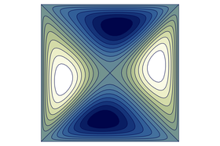

# FourSidedCavityFlow.jl Documentation

```@meta
CurrentModule = FourSidedCavityFlow
DocTestSetup = quote
    using FourSidedCavityFlow 
end
```

The four-sided cavity flow is a two-dimensional flow problem. It is an extension of the
simple one-sided lid-driven case, where all lids move with the same velocity
profile and parallel lids move in opposite directions.

```@raw html
<center></center>
```

```math
\partial_t \Delta \Psi = \frac{1}{\mathrm{Re}} \Delta^2 \Psi
  + (\partial_x \Psi) \partial_y(\Delta \Psi)
  - (\partial_y \Psi) \partial_x(\Delta \Psi)
```

This Julia module explores a regularized version of the four-sided lid-driven
cavity for incompressible fluids to be used as a validator benchmark for
Navier-Stokes solvers. The regularization overcomes the corner singularities
which are due to the discontinuous boundary conditions. The considered method
recovers exponential convergence with a pseudo-spectral Chebyshev
discretization scheme. Below the regularization function is shown.  

## Installation

This module is not a registered package. To install the FourSidedCavityFlow.jl, 
run the following commands in your shell.
```bash
git clone https://github.com/morwald/FourSidedCavityFlow.jl.git
cd FourSidedCavityFlow.jl
julia
```

Inside the Julia REPL open the built-in package manager Pkg by pressing `]` and then
run.
```julia
pkg>activate .
pkg>instantiate
```
This will activate the package and download the necessary dependencies.

## Tutorial

To set up the problem, instantiate the `struct p`, called CavityStruct, with a
Chebyshev polynomial of order `n` and a Reynolds number `Re`. This generates a
grid of size $(n+1)\times(n+1)$, and all the parameters and cache variables
needed to run the simulations.
```julia
using FourSidedCavityFlow 
const CF = FourSidedCavityFlow

n = 64
Re = 1
p = CF.setup_struct(n, Re);
```

### Symmetric and asymmetric solutions

We can run the `steadystate` function for a given Reynolds number `Re` to
converge to a steady-state solution with the Newton's method. For example the
symmetric base solution for a Reynolds of `Re = 50` can be computed by taking a
uniformly random initial guess.

```julia
Re_start = 100
p.params.Re = Re_start
Ψ0 = 1e-3 * randn((n + 1), (n + 1))

Ψ = CF.steadystate(Ψ0, p);
```

We can visualize the results in the physical domain by transposing the `Ψ`
matrix and mirror the solution at the y axis. 
```
using Plots

plt = contourf(
    reverse(p.params.nodes),
    reverse(p.params.nodes),
    Ψ';
    xlim = (-1, 1),
    ylim = (-1, 1),
    aspect_ratio = 1,
    axis = ([], false),
    legend = false,
    color = :davos);
```
```@raw html

```

## API

```@autodocs
Modules = [FourSidedCavityFlow]
```

